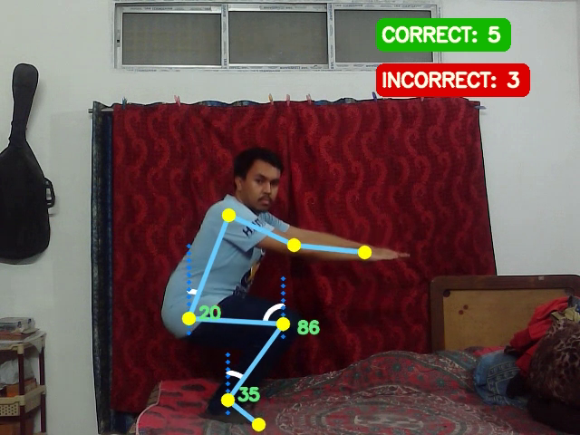
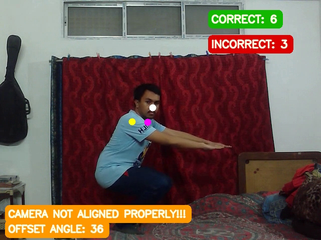

# Hack_Fitness_Trainer
&nbsp;

# Fitness Trainer using Mediapipe and OpenCV in Python

## About Project

This Application allows users to do their regular exercise with the help of an AI fitness trainer at home. This application is beneficial to some Users to get solved their various health problems such as being overweight or any other health problems.  <br>
We build an AI fitness trainer that can help you perform exercise positions seamlessly by keeping counts of proper and improper positions. The application will also have provisions to perform exercises, along with appropriate feedback. <br>

## Software Used
- Python 3.x

## Libraries Used 
- streamlit (pip install streamlit)
- mediapipe (pip install mediapipe)
- opencv (pip install opencv-python)

## Clone this Repository 
``` git clone https://github.com/thepriyankakashyap/Hack_Fitness_Trainer.git ```

## Run the Code
``` streamlit run Demo.py ```

## Output 
<div align="center">

</div>
<div align="center">

</div>

## Output Video🎬 - https://youtu.be/mn-h1f8Rts8 


## Project Created by - 
- Priyanka Kashyap - [thepriyankakashyap](https://github.com/thepriyankakashyap)
- Nilutpol Kashyap - [nilutpolkashyap](https://github.com/nilutpolkashyap)

 Created as part of hackathon submission to [HackFit 2](https://hackfit-2.devpost.com)

Hackathon Submission Link - [Hack Fitness Trainer](https://devpost.com/software/hack-fitness-trainer)


